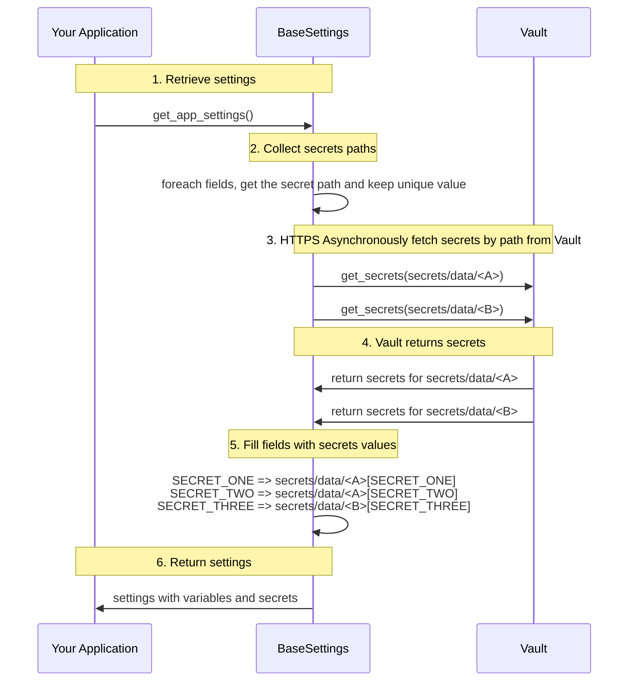

  [](https://pypi.org/project/pydantic2-settings-vault/) [](https://pypi.org/project/pydantic2-settings-vault/)


# pydantic2-settings-vault

Simple extension of [pydantic_settings](https://docs.pydantic.dev/latest/concepts/pydantic_settings/) to collect secrets in [HashiCorp Vault](https://www.hashicorp.com/fr/products/vault) OpenSource (OSS) and Enterprise

__pydantic2-settings-vault__ is a extension for Pydantic Settings that enables secure configuration management by integrating with __HashiCorp Vault__. This library supports both the open-source (OSS) and Enterprise versions of Vault, providing a seamless way to retrieve and manage secrets within your Pydantic-based applications. By leveraging Vault's robust security features, __pydantic2-settings-vault__ allows developers to easily incorporate secure secret management practices into their Python projects, enhancing overall application security and simplifying the handling of sensitive configuration data.

  - [Installation](#installation)
  - [Development](#development)
  - [Demonstration](#demonstration)
  - [License](#license)
  - [Contact](#contact)

## Installation

pip

```bash
pip install pydantic2-settings-vault
```
poetry

```bash
poetry add pydantic2-settings-vault
```

uv

```bash
uv add pydantic2-settings-vault
```

## Development

This project uses [Just](https://github.com/casey/just) as its task runner. Install [uv](https://docs.astral.sh/uv/) and [just](https://github.com/casey/just), then:

```bash
just install      # install dependencies
just test         # run tests
just coverage     # run tests with 100% coverage enforcement
just lint         # ruff check and format verification
just format       # auto-fix lint issues and format code
just type-check   # pyright static analysis
just check        # lint, type-check, and test
just build        # build package (requires VERSION env var)
```

List all recipes:

```bash
just --list
```

See [docs/development.md](docs/development.md) for the full task reference.

### Getting started

Create a class __AppSettings__ that inherit of __BaseSettings__ . 

Create a field for each vault secret. 

ex: 
```python
MY_SECRET: SecretStr = Field(
        ...,
        json_schema_extra={
            "vault_secret_path": "secret/test",
            "vault_secret_key": "FOO",  # pragma: allowlist secret
        },
    )
```

For KV v2 (default), use the logical path `mount/secret-name`. The library adds the `/data/` segment for Vault HTTP reads. You can also pass the full API path `secret/data/test`. See [docs/vault-kv-and-policies.md](docs/vault-kv-and-policies.md) for KV v1, policies, and field-mapping patterns.

#### Full example
```python
from functools import lru_cache
from threading import Lock
from typing import Tuple, Type
from pydantic import Field, SecretStr
from pydantic_settings import (
    BaseSettings,
    PydanticBaseSettingsSource,
)
from pydantic2_settings_vault import VaultConfigSettingsSource

class AppSettings(BaseSettings):

    MY_SECRET: SecretStr = Field(
        ...,
        json_schema_extra={
            "vault_secret_path": "secret/test",
            "vault_secret_key": "FOO",  # pragma: allowlist secret
        },
    )
    
    @classmethod
    def settings_customise_sources(
        cls,
        settings_cls: Type[BaseSettings],
        init_settings: PydanticBaseSettingsSource,
        env_settings: PydanticBaseSettingsSource,
        dotenv_settings: PydanticBaseSettingsSource,
        file_secret_settings: PydanticBaseSettingsSource,
    ) -> Tuple[PydanticBaseSettingsSource, ...]:
        return (
            init_settings,
            env_settings,
            dotenv_settings,
            VaultConfigSettingsSource(settings_cls=settings_cls), #   add this line
        )

# The connection to Vault is done via HTTPS with AppRole authentication (default)
import os
os.environ['VAULT_URL'] = "<configure it>"
os.environ['VAULT_ROLE_ID'] = "<configure it>"
os.environ['VAULT_SECRET_ID'] = "<configure it>"

# Only with Enterprise edition
os.environ['VAULT_NAMESPACE'] = "<configure it>"
```

#### Authentication methods

Select the auth backend with `VAULT_AUTH_METHOD` (default: `approle`). Override the mount path with optional `VAULT_AUTH_MOUNT`.

| Method | `VAULT_AUTH_METHOD` | Required environment variables |
| --- | --- | --- |
| AppRole (default) | `approle` | `VAULT_ROLE_ID`, `VAULT_SECRET_ID` |
| Token | `token` | `VAULT_TOKEN` |
| Kubernetes | `kubernetes` | `VAULT_K8S_ROLE`, plus `VAULT_K8S_JWT` or service-account token file |
| AWS | `aws` | `VAULT_AWS_ROLE`, plus signed STS request env vars or `botocore` credentials |
| GCP | `gcp` | `VAULT_GCP_ROLE`, plus `VAULT_GCP_JWT` or `GOOGLE_APPLICATION_CREDENTIALS` |
| Azure | `azure` | `VAULT_AZURE_ROLE`, plus `VAULT_AZURE_JWT` or Azure managed identity |
| JWT | `jwt` | `VAULT_JWT_ROLE`, `VAULT_JWT` |
| OIDC | `oidc` | `VAULT_OIDC_ROLE`, plus `VAULT_OIDC_JWT` or `VAULT_OIDC_ID_TOKEN` |
| Cert | `cert` | `VAULT_CLIENT_CERT`, `VAULT_CLIENT_KEY`, optional `VAULT_CERT_NAME` |
| LDAP | `ldap` | `VAULT_LDAP_USERNAME`, `VAULT_LDAP_PASSWORD` |
| OCI | `oci` | `VAULT_OCI_ROLE`, plus signed request headers or `oci` SDK credentials |
| Userpass | `userpass` | `VAULT_USERPASS_USERNAME`, `VAULT_USERPASS_PASSWORD` |
| GitHub | `github` | `VAULT_GITHUB_TOKEN` |
| Okta | `okta` | `VAULT_OKTA_USERNAME`, `VAULT_OKTA_PASSWORD`, optional `VAULT_OKTA_TOTP` |
| Kerberos | `kerberos` | `VAULT_KERBEROS_TOKEN` (base64 SPNEGO token) |
| RADIUS | `radius` | `VAULT_RADIUS_USERNAME`, `VAULT_RADIUS_PASSWORD` |
| Alicloud | `alicloud` | `VAULT_ALICLOUD_ROLE`, plus pre-signed STS request env vars |
| CF | `cf` | `VAULT_CF_ROLE`, plus instance cert/key or pre-signed login fields |
| PCF | `pcf` | Same as CF (`VAULT_CF_ROLE`, instance cert/key or pre-signed fields) |

Common variables for every method:

- `VAULT_URL` — Vault API address (default: `http://127.0.0.1:8200`)
- `VAULT_NAMESPACE` — optional Enterprise namespace
- `VAULT_KV_VERSION` — KV engine version (`1` or `2`, default `2`)
- `VAULT_AUTH_MOUNT` — optional auth mount override (defaults match each method name above)

**Token auth** uses a pre-issued token directly; no login call is made.

**Kubernetes auth** reads the service-account JWT from `VAULT_K8S_JWT` or, by default, `/var/run/secrets/kubernetes.io/serviceaccount/token`.

**AWS auth** signs an STS `GetCallerIdentity` request with instance profile, environment keys, or web identity when `botocore` is installed (`pip install pydantic2-settings-vault[aws]`). You can also supply a pre-signed request via `VAULT_AWS_IAM_REQUEST_URL`, `VAULT_AWS_IAM_REQUEST_BODY`, and `VAULT_AWS_IAM_REQUEST_HEADERS`.

**GCP auth** obtains a service-account JWT from `google-auth` when installed (`pip install pydantic2-settings-vault[gcp]`), or from `VAULT_GCP_JWT`.

**Azure auth** obtains a managed-identity or service-principal token from `azure-identity` when installed (`pip install pydantic2-settings-vault[azure]`), or from `VAULT_AZURE_JWT`.

**JWT auth** sends a signed bearer token to the JWT auth mount (`POST /v1/auth/jwt/login`).

**OIDC auth** sends an OIDC ID token to the OIDC/JWT mount. Use `VAULT_OIDC_JWT` or `VAULT_OIDC_ID_TOKEN`. For Microsoft Entra ID distributed claims, set optional `VAULT_OIDC_DISTRIBUTED_CLAIM_ACCESS_TOKEN`.

**Cert auth** presents a TLS client certificate during login (`POST /v1/auth/cert/login`). Set `VAULT_CLIENT_CERT` and `VAULT_CLIENT_KEY`; optionally `VAULT_CERT_NAME` to target a specific certificate role.

**LDAP auth** binds with username and password (`POST /v1/auth/ldap/login/<username>`).

**OCI auth** signs a GET request to the OCI login endpoint. Provide pre-signed headers via `VAULT_OCI_REQUEST_HEADERS`, or install `oci` (`pip install pydantic2-settings-vault[oci]`) and use instance principal (`VAULT_OCI_AUTH_TYPE=instance`, default) or API key (`VAULT_OCI_AUTH_TYPE=api_key` with standard OCI config).

**Userpass auth** binds with username and password (`POST /v1/auth/userpass/login/<username>`).

**GitHub auth** sends a personal access token (`POST /v1/auth/github/login`).

**Okta auth** binds with username and password against Okta (`POST /v1/auth/okta/login/<username>`). Set optional `VAULT_OKTA_TOTP` and `VAULT_OKTA_MFA_PROVIDER` when MFA is required.

**Kerberos auth** sends a pre-generated SPNEGO token in the `Authorization: Negotiate` header (`POST /v1/auth/kerberos/login`). Set `VAULT_KERBEROS_TOKEN` to the base64 token value (without the `Negotiate` prefix).

**RADIUS auth** binds with username and password (`POST /v1/auth/radius/login/<username>`).

**Alicloud auth** verifies a signed STS `GetCallerIdentity` request. Provide `VAULT_ALICLOUD_IDENTITY_REQUEST_URL` and `VAULT_ALICLOUD_IDENTITY_REQUEST_HEADERS` (base64-encoded values from `vault login -method=alicloud` or your own signer).

**CF auth** signs the instance identity certificate with `CF_INSTANCE_KEY` (`POST /v1/auth/cf/login`). On a CF instance, set `VAULT_CF_ROLE` and rely on `CF_INSTANCE_CERT` / `CF_INSTANCE_KEY`, or provide `VAULT_CF_SIGNING_TIME` and `VAULT_CF_SIGNATURE`. Install `cryptography` (`pip install pydantic2-settings-vault[cf]`) to generate signatures locally.

**PCF auth** uses the same login payload as CF against the legacy `pcf` mount (`POST /v1/auth/pcf/login`).

Example token auth:

```python
os.environ["VAULT_AUTH_METHOD"] = "token"
os.environ["VAULT_TOKEN"] = "<configure it>"
os.environ["VAULT_URL"] = "<configure it>"
```

Example Kubernetes auth:

```python
os.environ["VAULT_AUTH_METHOD"] = "kubernetes"
os.environ["VAULT_K8S_ROLE"] = "<vault role>"
os.environ["VAULT_URL"] = "<configure it>"
# Optional: os.environ["VAULT_K8S_JWT"] = "<service account jwt>"
# Optional: os.environ["VAULT_AUTH_MOUNT"] = "kubernetes"
```

### Pre-startup validation

Validate Vault environment variables and field metadata before loading settings:

```python
from pydantic2_settings_vault import validate_vault_configuration

result = validate_vault_configuration(AppSettings)
if not result.valid:
    for issue in result.errors:
        print(f"{issue.code}: {issue.message}")

# Or fail fast during application startup:
validate_vault_configuration(AppSettings).raise_if_invalid()

# Optionally verify Vault authentication without fetching secrets:
validate_vault_configuration(AppSettings, check_auth=True).raise_if_invalid()
```

### Usage
app_settings_lock = Lock()

@lru_cache
def get_app_settings() -> AppSettings:
    with app_settings_lock:
        return AppSettings()  # type: ignore
```

### Internal interactions:



## License

Pydantic2-Settings-Vault is released under the MIT License. See the [LICENSE](LICENSE) file for more details.

## Contact

For questions, suggestions, or issues related to Pydantic2-Settings-Vault, please open an issue on the GitHub repository.

