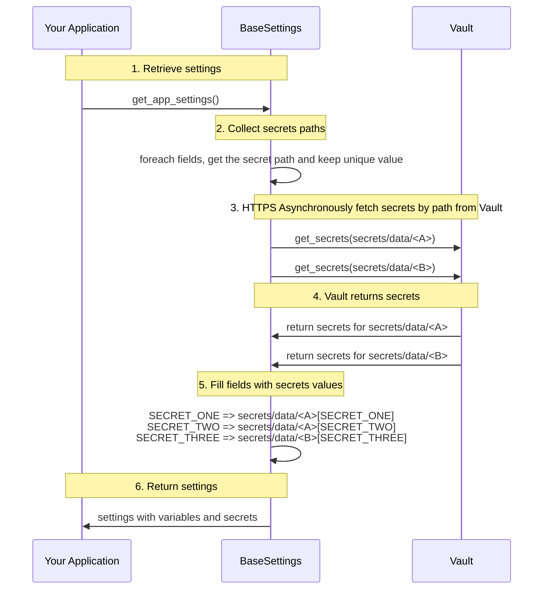

# pydantic2-settings-vault

**pydantic2-settings-vault** extends [Pydantic Settings](https://docs.pydantic.dev/latest/concepts/pydantic_settings/) to load secrets from [HashiCorp Vault](https://www.hashicorp.com/products/vault) (OSS and Enterprise). Annotate fields with Vault path metadata, authenticate with your preferred auth method, and let Pydantic validate the result.

## Installation

=== "pip"

    ```bash
    pip install pydantic2-settings-vault
    ```

=== "uv"

    ```bash
    uv add pydantic2-settings-vault
    ```

=== "poetry"

    ```bash
    poetry add pydantic2-settings-vault
    ```

Optional extras for cloud auth credential resolution:

| Extra | Purpose |
| --- | --- |
| `[aws]` | AWS IAM auth via `botocore` |
| `[gcp]` | GCP auth via `google-auth` |
| `[azure]` | Azure auth via `azure-identity` |
| `[oci]` | OCI request signing via `oci` SDK |
| `[cf]` | Cloud Foundry login signatures |
| `[cloud]` | All cloud extras above |

## Quick start

1. Define a settings model with Vault-backed fields and register the settings source:

```python
from pydantic import Field, SecretStr
from pydantic_settings import BaseSettings, PydanticBaseSettingsSource
from pydantic2_settings_vault import VaultConfigSettingsSource


class AppSettings(BaseSettings):
    API_KEY: SecretStr = Field(
        ...,
        json_schema_extra={
            "vault_secret_path": "secret/myapp/config",
            "vault_secret_key": "api_key",
        },
    )

    @classmethod
    def settings_customise_sources(
        cls,
        settings_cls,
        init_settings,
        env_settings,
        dotenv_settings,
        file_secret_settings,
    ):
        return (
            init_settings,
            env_settings,
            dotenv_settings,
            VaultConfigSettingsSource(settings_cls=settings_cls),
        )
```

2. Configure Vault authentication (AppRole is the default):

```bash
export VAULT_URL="https://vault.example.com:8200"
export VAULT_ROLE_ID="<role-id>"
export VAULT_SECRET_ID="<secret-id>"
```

3. Load settings:

```python
settings = AppSettings()
```

For KV v2 (the default), use the logical path `mount/secret-name` in field metadata; the library adds the `/data/` segment for HTTP reads.

## Documentation

| Guide | Description |
| --- | --- |
| [Usage guide](usage.md) | Field annotations, end-to-end setup, environment variables, troubleshooting |
| [Authentication](authentication.md) | All supported Vault auth methods and required environment variables |
| [Advanced configuration](advanced-configuration.md) | HTTP client tuning, secret cache, pre-startup validation |
| [Vault KV & policies](vault-kv-and-policies.md) | KV v1/v2 paths, policy examples, field-mapping patterns |

## How it works



## License

Released under the [MIT License](https://github.com/sylvainmouquet/pydantic2-settings-vault/blob/main/LICENSE).
